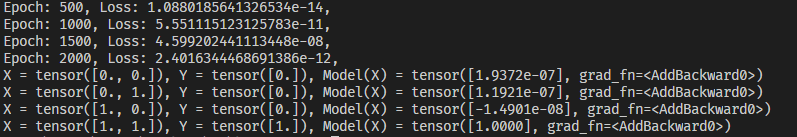
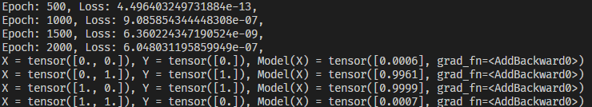

# Distance Kernel based Neural Networks

Recently there has been a lot of research done about neural networks, one of them being: https://arxiv.org/abs/2012.00152. The article is “Every Model Learned by Gradient Descent Is Approximately a Kernel Machine” by Pedro Domingos. Domingos proves that all neural networks are approximately equivalent to kernel machines. Essentially, a kernel machine is a model that takes an input and compares it with existing training data using a specific function called a kernel to classify the input. Even before this paper came out I highly suspected this so I started thinking about how to build a neural network where the layers are kernel machines, essentially a weird fuzzy decision tree kind of structure. After the paper was released, I decided to finish this work. One important future plan is to port it to CNNs, which I think will have much more to gain from this method. 


#### Implementation

A simple implementation is this: 

```python
import numpy as np

output = []
memories = np.array([[1,2,3]]) # essentially the weights of the layer, this is like its memory
Xs = np.array([[1,2,3],[3,2,1]]) # the inputs to the layer
for x in Xs:
    xout = []
    for memory in memories:
        # compare the input and memory
        xout.append(((x - memory)**2).mean()) # I found that MSE works best
    output.append(xout)
```

In reality, this is quite inefficient so I implemented this using pytorch’s broadcasting features.


#### Preliminary Results

From simple benchmarks like AND and XOR these layers seem to do well. There are better ways to initialize the weights but using the default weight initialization is ok. 

AND



XOR



Obviously a accuracy vs epoch curve would be better and some other benchmarks, but for now this is only a proof of concept.


#### Potential Improvements

- Better weight initialization
- Different kernel
  - The current distance kernel creates a chi squared distribution which could affect either other instances of this layer or dense layers

